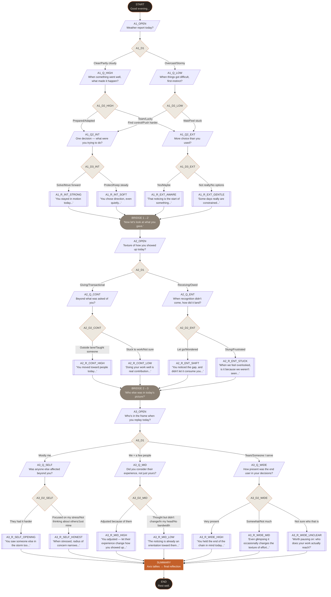

```mermaid
flowchart TD
    START([START\nGood evening...]) --> A1_OPEN

    A1_OPEN[/A1_OPEN\nWeather report today?/] --> A1_D1{A1_D1}

    A1_D1 -->|Clear/Partly cloudy| A1_Q_HIGH
    A1_D1 -->|Overcast/Stormy| A1_Q_LOW

    A1_Q_HIGH[/A1_Q_HIGH\nWhen something went well, what made it happen?/] --> A1_D2_HIGH{A1_D2_HIGH}
    A1_Q_LOW[/A1_Q_LOW\nWhen things got difficult, first instinct?/] --> A1_D2_LOW{A1_D2_LOW}

    A1_D2_HIGH -->|Prepared/Adapted| A1_Q2_INT
    A1_D2_HIGH -->|Team/Lucky| A1_Q2_EXT
    A1_D2_LOW -->|Find control/Push harder| A1_Q2_INT
    A1_D2_LOW -->|Wait/Feel stuck| A1_Q2_EXT

    A1_Q2_INT[/A1_Q2_INT\nOne decision — what were you trying to do?/] --> A1_D3_INT{A1_D3_INT}
    A1_Q2_EXT[/A1_Q2_EXT\nMore choice than you used?/] --> A1_D3_EXT{A1_D3_EXT}

    A1_D3_INT -->|Solve/Move forward| A1_R_INT_STRONG
    A1_D3_INT -->|Protect/Keep steady| A1_R_INT_SOFT
    A1_D3_EXT -->|Yes/Maybe| A1_R_EXT_AWARE
    A1_D3_EXT -->|Not really/No options| A1_R_EXT_GENTLE

    A1_R_INT_STRONG[["A1_R_INT_STRONG\n'You stayed in motion today...'"]] --> BRIDGE_1_2
    A1_R_INT_SOFT[["A1_R_INT_SOFT\n'You chose direction, even quietly...'"]] --> BRIDGE_1_2
    A1_R_EXT_AWARE[["A1_R_EXT_AWARE\n'That noticing is the start of something...'"]] --> BRIDGE_1_2
    A1_R_EXT_GENTLE[["A1_R_EXT_GENTLE\n'Some days really are constrained...'"]] --> BRIDGE_1_2

    BRIDGE_1_2(["BRIDGE 1→2\n'Now let's look at what you gave.'"]) --> A2_OPEN

    A2_OPEN[/A2_OPEN\nTexture of how you showed up today?/] --> A2_D1{A2_D1}

    A2_D1 -->|Giving/Transactional| A2_Q_CONT
    A2_D1 -->|Receiving/Owed| A2_Q_ENT

    A2_Q_CONT[/A2_Q_CONT\nBeyond what was asked of you?/] --> A2_D2_CONT{A2_D2_CONT}
    A2_Q_ENT[/A2_Q_ENT\nWhen recognition didn't come, how did it land?/] --> A2_D2_ENT{A2_D2_ENT}

    A2_D2_CONT -->|Outside lane/Taught someone| A2_R_CONT_HIGH
    A2_D2_CONT -->|Stuck to work/Not sure| A2_R_CONT_LOW
    A2_D2_ENT -->|Let go/Wondered| A2_R_ENT_SHIFT
    A2_D2_ENT -->|Stung/Frustrated| A2_R_ENT_STUCK

    A2_R_CONT_HIGH[["A2_R_CONT_HIGH\n'You moved toward people today...'"]] --> BRIDGE_2_3
    A2_R_CONT_LOW[["A2_R_CONT_LOW\n'Doing your work well is real contribution...'"]] --> BRIDGE_2_3
    A2_R_ENT_SHIFT[["A2_R_ENT_SHIFT\n'You noticed the gap, and didn't let it consume you...'"]] --> BRIDGE_2_3
    A2_R_ENT_STUCK[["A2_R_ENT_STUCK\n'When we feel overlooked, is it because we weren't seen...'"]] --> BRIDGE_2_3

    BRIDGE_2_3(["BRIDGE 2→3\n'Who else was in today's picture?'"]) --> A3_OPEN

    A3_OPEN[/A3_OPEN\nWho's in the frame when you replay today?/] --> A3_D1{A3_D1}

    A3_D1 -->|Mostly me| A3_Q_SELF
    A3_D1 -->|Me + a few people| A3_Q_MID
    A3_D1 -->|Team/Someone I serve| A3_Q_WIDE

    A3_Q_SELF[/A3_Q_SELF\nWas anyone else affected beyond you?/] --> A3_D2_SELF{A3_D2_SELF}
    A3_Q_MID[/A3_Q_MID\nDid you consider their experience, not just yours?/] --> A3_D2_MID{A3_D2_MID}
    A3_Q_WIDE[/A3_Q_WIDE\nHow present was the end user in your decisions?/] --> A3_D2_WIDE{A3_D2_WIDE}

    A3_D2_SELF -->|They had it harder| A3_R_SELF_OPENING
    A3_D2_SELF -->|Focused on my stress/Not thinking about others/Just mine| A3_R_SELF_HONEST
    A3_D2_MID -->|Adjusted because of them| A3_R_MID_HIGH
    A3_D2_MID -->|Thought but didn't change/In my head/No bandwidth| A3_R_MID_LOW
    A3_D2_WIDE -->|Very present| A3_R_WIDE_HIGH
    A3_D2_WIDE -->|Somewhat/Not much| A3_R_WIDE_MID
    A3_D2_WIDE -->|Not sure who that is| A3_R_WIDE_UNCLEAR

    A3_R_SELF_OPENING[["A3_R_SELF_OPENING\n'You saw someone else in the storm too...'"]] --> SUMMARY
    A3_R_SELF_HONEST[["A3_R_SELF_HONEST\n'When stressed, radius of concern narrows...'"]] --> SUMMARY
    A3_R_MID_HIGH[["A3_R_MID_HIGH\n'You adjusted — let their experience change how you showed up...'"]] --> SUMMARY
    A3_R_MID_LOW[["A3_R_MID_LOW\n'The noticing is already an orientation toward them...'"]] --> SUMMARY
    A3_R_WIDE_HIGH[["A3_R_WIDE_HIGH\n'You held the end of the chain in mind today...'"]] --> SUMMARY
    A3_R_WIDE_MID[["A3_R_WIDE_MID\n'Even glimpsing it occasionally changes the texture of effort...'"]] --> SUMMARY
    A3_R_WIDE_UNCLEAR[["A3_R_WIDE_UNCLEAR\n'Worth pausing on: who does your work actually reach?'"]] --> SUMMARY

    SUMMARY[["SUMMARY\nAxis tallies → final reflection"]] --> END([END\nRest well.])

    style START fill:#2a2420,color:#e8e0d4,stroke:#c4602a
    style END fill:#2a2420,color:#e8e0d4,stroke:#c4602a
    style BRIDGE_1_2 fill:#8a7f72,color:#f5f0e8,stroke:none
    style BRIDGE_2_3 fill:#8a7f72,color:#f5f0e8,stroke:none
    style SUMMARY fill:#c4602a,color:#fff,stroke:none
    style A1_D1 fill:#ede8df,stroke:#c4602a
    style A1_D2_HIGH fill:#ede8df,stroke:#c4602a
    style A1_D2_LOW fill:#ede8df,stroke:#c4602a
    style A1_D3_INT fill:#ede8df,stroke:#c4602a
    style A1_D3_EXT fill:#ede8df,stroke:#c4602a
    style A2_D1 fill:#ede8df,stroke:#c4602a
    style A2_D2_CONT fill:#ede8df,stroke:#c4602a
    style A2_D2_ENT fill:#ede8df,stroke:#c4602a
    style A3_D1 fill:#ede8df,stroke:#c4602a
    style A3_D2_SELF fill:#ede8df,stroke:#c4602a
    style A3_D2_MID fill:#ede8df,stroke:#c4602a
    style A3_D2_WIDE fill:#ede8df,stroke:#c4602a
```
